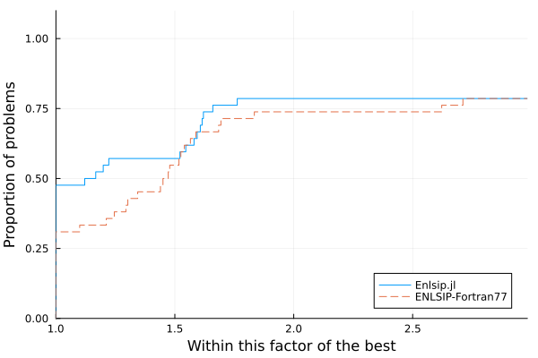

# Summary

 [Enlsip.jl](https://github.com/UncertainLab/Enlsip.jl) is a Julia  [@Julia:2017] package that implements a solver for nonlinear least squares with nonlinear constraints.

This type of problems is mathematically formulated as:
\begin{equation}\label{eq:cnlls}
         \quad \begin{aligned}  
                        \quad	\min_{x \in \mathbb{R}^n}        \quad&  \dfrac{1}{2} \sum_{i=1}^{m} r_i(x)^2  \\
                        \text{s.t.}      \quad & c_i(x)=0, \quad i =1,\ldots,q\\
                        & c_i(x) \geq 0, \quad i=q+1,\ldots,\ell,
        \end{aligned}
\end{equation}

where the functions $(r_1,\ldots,r_m)$, often denoted as the residuals, and constraints $(c_1,\ldots,c_\ell)$ are two-times differentiable.

This package is the Julia version of ``ENLSIP`` (Easy Nonlinear Least Squares Inequality Program), an open-source Fortran77 library developed by @lindstromwedin1988[^1].

[^1]: The source code is available at [https://plato.asu.edu/sub/nonlsq.html](https://plato.asu.edu/sub/nonlsq.html)

# Statement of need

The ``ENLSIP`` Fortran77 library has been successfully used since the early 2000s by Hydro-Québec, the main electricity supplier for the province of Quebec in Canada, to calibrate its short-term electricity demand forecast models [@grenieretal:2006], which are coded in Fortran90. Since Hydro-Québec is transitioning from Fortran77 to Julia and its systems are used in a highly critical context, the primary goal of this transition is to ensure that the replacing Julia version reproduces the results obtained with the original Fortran77 version. The conversion of the above-mentioned ``ENLSIP`` library to Julia is a crucial part of this process.

Nonlinear least squares arise in a variety of model calibration scenarios. Formulation \eqref{eq:cnlls} is particularly relevant in contexts where additional constraints, such as those related to physical models, need to be satisfied. This is due to the high-risk nature of Hydro-Québec's forecasting operations. Moreover, the specific structure of the objective function in \eqref{eq:cnlls} can be exploited to design algorithms more efficient than solvers for general nonlinear programming.

Comparison of results and performance on operational Hydro-Québec optimization problems have been conducted using a Julia-Fortran interface and they have shown very good concordance results. We additionally compared numerical results on nonlinear programming test problems [@hockschittkowski:1980; @lucksanvlcek:1999] to ascertain whether the two versions could yield significantly disparate outcomes or distinct solutions. On the tested problems, we observed no differences in convergence behavior. Furthermore, the obtained solutions did not differ from a predetermined tolerance, the same one we previously employed to ensure the results of our Julia version were consistent with the requirements of Hydro-Québec.

## Method

The ``ENLSIP`` solver incorporates an iterative Gauss-Newton method. At each iteration, the algorithm solves an approximation of the original problem \eqref{eq:cnlls} obtained by first linearizing both residuals and constraints in a small neighborhood of the current point. Then, a subset of constraints, treated as equalities for the ongoing iteration, is formed. It contains all the equality constraints and the inequality constraints that are believed to be active, i.e. satisfied with equality, at the solution. The strategy implemented by the authors to select the appropriate inequality constraints at each iteration follows the principles exposed in chapter 6 of @gillmurraywright:1985. This results in a subproblem with a linear least-squares objective and linear equality constraints that is solved with a null-space type method [@nocedalwright:2006, chapter 15].

To our knowledge, there is no formal proof of convergence for the method implemented in ENLSIP, although local convergence at a linear rate can be expected from the Gauss-Newton paradigm. In practice, the algorithm performs better when the starting point is relatively close to a solution of the problem. However, the algorithm is not designed for large scale least squares. Performance tend, indeed, to deteriorate on problems with a few hundreds of parameters and constraints $(n+\ell \geq 200)$ and more than a thousand residuals $(m\geq 1000)$.

## From Fortran77 to Julia

Our first motivation to convert ``ENLSIP`` in Julia was to improve reliability, readability and ease of maintenance of the original code. Also, linear algebra tools in Julia, based on [OpenBLAS](http://www.openblas.net), benefit from improved implementations than those of the algorithm by @lindstromwedin1988, based on [MINPACK](https://www.netlib.org/minpack/).
Furthermore, this language is highly convenient for optimization, offering various interface tools such as ``JuMP`` [@JuMP:2017] or ``NLPModels`` [@nlp-models:2020], to model optimization problems. Although these libraries are not currently used in our package, they are under consideration for future developments.

## Numerical experiments

Performances of the two versions were compared using problems derived from Hydro-Québec operations and also problems from the literature. We illustrate this comparison on the estimation of CM1 model parameters; it is a nonlinear regression model used for the hourly load forecast [@grenieretal:2006]. The calibration process requires the use of weather data collected across the province of Quebec. The configuration of this model can be adapted to the number of parameters to be calibrated and the amount of data to be used. In total, 90 different instances can be thus defined with the following features:

- from 258 to 726 parameters,
- from 468 to 716 total constraints (with 2 to 10 equalities),
- from 4392 to 17,568 residuals.

Due to the differences in how computations are organized between Fortran77 and Julia, especially in linear algebra, minor numerical discrepancies were expected to emerge and accumulate, leading to slightly different outcomes or total number of iterations performed.

Out of 90 instances, 26 either failed to converge or stopped because of a numerical error occuring during the execution of both ``ENLSIP`` versions. These results were due to inconsistencies in problem formulations of a given family of instances and we thus chose to exclude them from our tests, since they are not representative of the robustness of the method implemented in ENLSIP. We rather considered more relevant to study the 64 remaining instances, for which both versions reached similar solutions that met Hydro-Québec specifications. Although specific values cannot be disclosed in this paper, the performance profile [@dolanmore:2002] in Figure \ref{fig:perf_profile} suggests that our Julia version has similar, if not better, performances than the Fortran77 version. However, these results must be weighted by the number of iterations performed by the two algorithms. Indeed, our Julia version often required less iterations. We argue that the better efficiency of the linear algebra routines from OpenBLAS over those from MINPACK may contribute to reduced computation times.



## Other nonlinear least-squares packages

Several existing Julia packages can be used to solve nonlinear least-squares problems, such as [NL2sol.jl](https://github.com/macd/NL2sol.jl), [LsqFit.jl](https://github.com/JuliaNLSolvers/LsqFit.jl) and [LeastSquaresOptim.jl](https://github.com/matthieugomez/LeastSquaresOptim.jl), for unconstrained and bound constrained problems, or [CaNNOLeS.jl](https://github.com/JuliaSmoothOptimizers/CaNNOLeS.jl) for equality constrained problems. However, they do not entirely cover the formulation stated in \eqref{eq:cnlls}, for which general solvers such as [Ipopt.jl](https://github.com/jump-dev/Ipopt.jl) can be used efficiently.

Although our package may not incorporate the latest advancements in least squares and nonlinear optimization, especially for large-scale problems, its use remains relevant.
Indeed, the method employed in ``ENLSIP`` manages to exploit the least-squares structure while also remaining very general, covering nonlinearity and non-convexity of the residuals and constraints. This capability renders it an effective tool for solving problems of reasonable dimensions ($n\leq 500$ and $m\leq 1000$). Moreover, in comparison to other categories, like the unconstrained case [as discussed in @dennisschnabel:1996, chapter 10], this specific class of least squares with general constraints is, to the best of our knowledge, rarely addressed in the literature.

# Usage

[Enlsip.jl](https://github.com/UncertainLab/Enlsip.jl) can be dowloaded from the Julia package manager by running the following command into the REPL:

```julia
using Pkg 
Pkg.add("Enlsip")
```

The package provides a basic interface for modeling optimization problems of the form \eqref{eq:cnlls}, by passing the residuals, constraints functions and dimensions of the problem.
This is accomplished by creating an instance of our `CnlsModel` structure.
Users can also provide functions to compute Jacobian matrices of residuals and constraints, or they can let the algorithm compute them numerically using automatic differentiation[^AD] [@griewank:2003].

[^AD]: Backend used by default is [ForwardDiff.jl](https://juliadiff.org/ForwardDiff.jl/stable/)

As a short tutorial, we consider the following problem [@hockschittkowski:1980, problem 65]:

\begin{equation}\label{eq:hickschitt_pb65}
         \quad \begin{aligned}  
                        \quad\min_{x_1,x_2,x_3}        \quad&  (x_1-x_2)^2 + \dfrac{1}{9}(x_1+x_2-10)^2+(x_3-5)^2  \\
                        \text{s.t.}      \quad & 48-x_1^2-x_2^2-x_3^2 \geq 0 \\
                        & -4.5\leq x_i \leq 4.5, \quad i=1,2\\
                        & -5 \leq x_3  \leq 5,
        \end{aligned}
\end{equation}

and show how to use the package to model and solve problem \eqref{eq:hickschitt_pb65}:

```julia
using Enlsip

# Dimensions of the problem

n = 3 # number of parameters
m = 3 # number of residuals
l = 1 # number of nonlinear inequality constraints

# Residuals and Jacobian matrix associated
r(x::Vector) = [x[1] - x[2]; (x[1]+x[2]-10.0) / 3.0; x[3]-5.0]

jac_r(x::Vector) = [1. -1. 0; 1/3 1/3 0.; 0. 0. 1.]

# Constraints (one nonlinear inequality and box constraints)
c(x::Vector) = [48.0 - x[1]^2-x[2]^2-x[3]^2]
jac_c(x::Vector) = [ -2x[1] -2x[2] -2x[3]]
x_l = [-4.5, -4.5, -5.0]
x_u = [4.5, 4.5, 5.0] 

# Starting point 
x0 = [-5.0, 5.0, 0.0]

# Instantiate the  model associated with the problem 
model = Enlsip.CnlsModel(r, n, m; jacobian_residuals=jac_r, starting_point=x0,
      ineq_constraints = c, jacobian_ineqcons=jac_c, nb_ineqcons = l,
      x_low=x_l, x_upp=x_u)
```

Once a model has been instantiated, the solver function can be called.

```julia
# Call of the `solve!` function
Enlsip.solve!(model)
```

After solving, there are available methods to get details about the conduct of the algorithm. For instance, on the example presented above, calling `Enlsip.solution(model)` will return the solution found.

Additional information on how to use the package and examples with test problems can be found in the [online documentation](https://uncertainlab.github.io/Enlsip.jl/stable)[^doc].

[^doc]: [https://uncertainlab.github.io/Enlsip.jl](https://uncertainlab.github.io/Enlsip.jl)

# Acknowledgements

The research has been supported by MITACS grants IT25656, IT28724, and IT36208. We would also like to mention that the release of [Enlsip.jl](https://github.com/UncertainLab/Enlsip.jl) results from a close collaboration between the University of Montreal and the Unit of Inflow and Load Forecasting of Hydro-Québec. The work of Fabian Bastin is supported by the Natural Sciences and Engineering Research Council of Canada [Discovery Grant 2022-04400].

# References